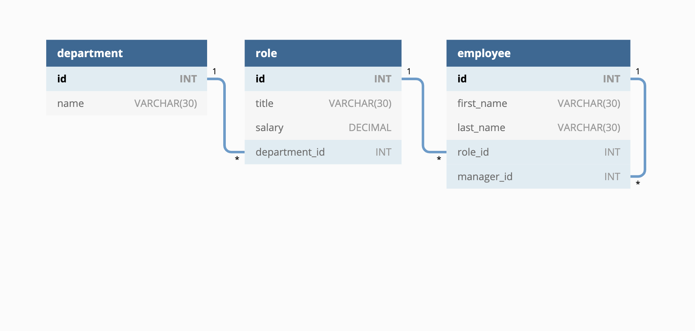

# rollodex
MySQL initiated node app that allows a Manager to view their employees. 

## Description 📜
A business owner wishes to be able to view and manage the departments, roles, and employees in their company SO THAT they can organize and plan their business as they see fit.

## Motivation 💪🏻
This project was created to use mySQL 

## Build status 🏗
* The starter code has been built by Adela Kobic 

## Code style 🔐
* Standard HTML and CSS has been used for this project. 
The language for the website is written in US English. (USA English)

## Acceptance Criteria ✅
* GIVEN a command-line application that accepts user input
* * WHEN I start the application
THEN I am presented with the following options: view all departments, view all roles, view all employees, add a department, add a role, add an employee, and update an employee role
* WHEN I choose to view all departments
THEN I am presented with a formatted table showing department names and department ids
* WHEN I choose to view all roles
THEN I am presented with the job title, role id, the department that role belongs to, and the salary for that role
* WHEN I choose to view all employees
THEN I am presented with a formatted table showing employee data, including employee ids, first names, last names, job titles, departments, salaries, and managers that the employees report to
* WHEN I choose to add a department
THEN I am prompted to enter the name of the department and that department is added to the database
* WHEN I choose to add a role
THEN I am prompted to enter the name, salary, and department for the role and that role is added to the database
* WHEN I choose to add an employee
THEN I am prompted to enter the employee’s first name, last name, role, and manager, and that employee is added to the database
* WHEN I choose to update an employee role
THEN I am prompted to select an employee to update and their new role and this information is updated in the database.

## Assets 📷
Image of how the intended Rollodex should look like. 

Video demo of how the Rollodex is intended to work

## Problems encountered 🤯
* geting 

## Changes made to the code 𝌡
* the 

## Link to the Screencastify video 📺

## Credits 💃🏻
* Not applicable 

## Licence 🪪
* No license chosen. 